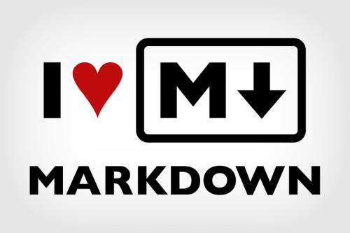
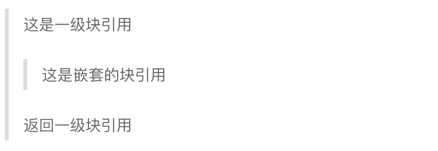

## 概述

MarkDown 致力于使阅读和创作文档变得容易,视可读性为最高准则，基于此，MarkDown完全由标点符号组成。

<!-- more -->

### 与HTML混合使用

MarkDown 仅对应一小部分HTML标签，对于其未包含的标签，可以直接使用HTML。

**注意事项**

* 在 MarkDown 中HTML的块级元素应该另起一行，并且顶格写。
* HTML的块级元素中的 MarkDown 语句不会生效。
* HTML的内联元素没有上述两条限制

### 字符表现方式简洁

所谓字符表现方式简洁，是指不用像在HTML中把 `&` 写成 `&amp;` 转义字符一样。在 MarkDown 中，随心所欲的写各种字符即可。

## 块级元素

### 段落与换行

一个或者多个空行（可含space）可实现段落划分；使用硬换行实现换行，即Enter键换行；` ` 换行在 MarkDown 行不通。

### 标题

#### Setext 样式标题

Setext样式在标题下使用等于号来表示一级标题，渲染h1标签；在标题下使用连字符来表示二级标题，渲染成h2标签，如下

    这是一个 H1
    =============

    这是一个 H2
    -------------

#### Atx 样式标题

Atx样式标题使用一个或多个（最多六个） `#` 开头，依次代表h1-h6，写法如下：

    ### 这是一个H3

### 块引用

在 MarkDown 中使用 `>` 创建块引用. 最好对引用文本采取强制换行并在每一行行首放一个 `>` 。块引用可以嵌套 (例如, 块引用中包含块引用) , 只需添加额外层级的 `>` 即可。块引用可以包含 Markdown 元素, 包括标题, 列表和代码块。

    > 这是一级块引用
    >
    > > 这是嵌套的块引用
    >
    > 返回一级块引用

上面的代码可以渲染出如下的效果：

### 列表

#### 无序列表

无序列表使用星号, 加号, 和连字符作为每一项的开头，它们可以互换。写法如下：

    * 项目一
    * 项目二
    * 项目三

    + 项目一
    + 项目二
    + 项目三

    - 项目一
    - 项目二
    - 项目三

#### 有序列表

有序列表以阿拉伯数字加英文句号开头，数字大小顺序并不重要，不影响渲染，渲染结果始终从1开始。写法如下：

    1. 项目一
    2. 项目二
    3. 项目三

### 代码块

要在 Markdown 中插入代码块, 只需要将每一行都缩进 4 个空格或者 1 个水平制表符（即一个tab），Markdown 渲染时会用 `<pre>` 和 `<code>` 标签包围代码块。写法如下：

    这行是顶格写的。
        这行缩进了4个空格，将会被渲染成代码块。

### 水平线

如果一行中只有三个以上的连字符, 星号, 或者下划线则会在该位置生成一个 `
` 标签. 星号和连字符之间的空格也是允许的. 

    * **  有空格的3个星号

    -- -  有空格的3个连字符

    ___  3个下划线

水平线的效果如下：

-------

## 内联元素

### 链接

MarkDown 的链接有内联链接和引用链接两种方式，支持相对路径和绝对路径。

#### 内联链接

内联链接的优势在于字符量较少，但是劣势尤为明显，不利于阅读。其写法如下：

    [link display name](http://example.com/ "optional title")

#### 引用链接

引用了解是将链接定义成一个id，然后由需要的地方进行引用，引用谅解利于阅读：

    [link display name][link id]   // 引用链接,两个中括号之间可以存在空格
    [link id]: http://example.com/  "Optional Title Here"  // 定义链接，需要独占一行，可以定义同一个文件的任何地方
    [link id]: <http://example.com/>  "Optional Title Here" // 定义链接，链接可以使用 <> 括起来

如果链接显示的文字和链接的id相同，可以有如下写法：

    [displayNameSameWithLinkId][]  // 引用链接
    [displayNameSameWithLinkId]: http://example.com/  "Optional Title Here"  // 定义链接

### 强调

MarkDown 将星号 `*` 和下划线 `_` 作为强调标记. 用 `*` 或者 `_` 包裹的文本将会用 HTML `<em>` 标签包裹,倾斜; 双 `*` 或者 `_` 将会用 HTML `<strong>` 标签包裹，加粗. 

    _单个下划线_

    **双星**

### 代码

要在MarkDown中输出一个代码片段, 需要使用重音符号 `` ` `` 。如果需要在代码中显示 `` ` `` , 则需要需要使用多个 `` ` `` 作为开始和结尾标记。写法如下：

    `代码`
    `` ` ``  // 在代码中显示 `

### 图片

MarkDown 中的图片和链接十分相似，也分为内联和引用。但 MarkDown 图片不能指定图片大小，如需要，推荐使用 `img`。标签写法如下：

      // 内联写法
    
    // 引用写法

    ![Alt text][id]  // 引用图片链接
    [id]: url/to/image  "Optional title attribute"  // 定义图片链接

### 自动链接

    <http://example.com/> 这种写法将会被 MarkDown 渲染成 <a href="http://example.com/">http://example.com/</a>

### 转义字符

MarkDown 使用 `\` 进行字符转义。支持如下字符进行反斜杠转义：

    \   backslash
    `   backtick
    *   asterisk
    _   underscore
    {}  curly braces
    []  square brackets
    ()  parentheses
    #   hash mark
    +   plus sign
    -   minus sign (hyphen)
    .   dot
    !   exclamation mark

**THE END**

------
