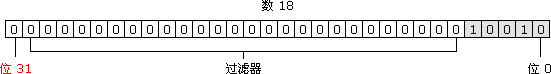

## JS按位操作符（Bitwise operators）

### 做什么的？

将其操作数（operands）当作 **`32位的比特序列`**（由0和1组成）, 按位操作符操作数字的二进制形式，但是返回值依然是标准的JavaScript数值。

所有的按位操作符的操作数都会被转成补码（two's complement）形式的有符号32位整数。

- 32位的比特序列

ECMAScript 整数有两种类型，即有符号整数（允许用正数和负数）和无符号整数（只允许用正数）。在 ECMAScript 中，所有整数字面量默认都是有符号整数;

<!-- more -->

有符号整数使用 31 位表示整数的数值 `（数值位）`，用第 32 位表示整数的符号 `（符号位）`，0 表示正数，1 表示负数。



- 原码/反码/补码

```js
/*
 * 正数的原码/反码/补码 一致
 * 负数的原码：其绝对值的原码符号位取反（0->1, 1->0）
 * 负数的反码：其绝对值的原码整体取反
 * 负数的补码：其绝对值的原码整体取反后+1
 *
 */
 
 18 （base 10）
 原/反/补 码：000000000000000000000000010010
 
 -18（base 10）
 原码：100000000000000000000000010010
 反码：111111111111111111111111101101
 补码：111111111111111111111111101110
 
```
- 优劣势

直接对二进制数值进行运算，属于较为底层的运算，运算速度快，但是同样，可读性差


### 家庭成员

```text

按位操作符
│
├─ 按位逻辑操作符
│         │
│         ├─ 按位与 &
│         ├─ 按位或 |
│         ├─ 按位非 ~
│         └─ 按位异或 ^
│
└─ 按位移动操作符
           │ 
           ├─ 左移 <<
           ├─ 有符号右移 >>
           └─ 无符号右移 >>>

```

### 按位逻辑操作符

操作规则：

- 操作数被转换成32位整数，用比特序列（0和1组成）表示，超过32位的数字会被丢弃。
- 第一个操作数的每个比特位与第二个操作数的相应比特位匹配，逐位运算


#### 按位与 &

**规则：1/1得1，否则为0**

```
// 1的二进制表示为: 00000000 00000000 00000000 00000001
// 3的二进制表示为: 00000000 00000000 00000000 00000011
------------------------------------------------------

             =>   00000000 00000000 00000000 00000001
console.log(1 & 3)     // 1

```

#### 按位或 |

**规则：0/0得0，否则为1**

```
// 1的二进制表示为: 00000000 00000000 00000000 00000001
// 3的二进制表示为: 00000000 00000000 00000000 00000011
------------------------------------------------------

             =>   00000000 00000000 00000000 00000011
console.log(1 | 3)     // 3

```

#### 按位非 ~

**规则：0 -> 1, 1 -> 0**

```text
// -1的二进制表示为: 11111111 11111111 11111111 11111111
------------------------------------------------------

             =>   00000000 00000000 00000000 00000000
console.log(~ -1)     // 0

- (x + 1)

```

#### 按位异或 ^

**规则：相同得0，不同得1**

```
// 1的二进制表示为: 00000000 00000000 00000000 00000001
// 3的二进制表示为: 00000000 00000000 00000000 00000011
------------------------------------------------------

             =>   00000000 00000000 00000000 00000010
console.log(1 ^ 3)     // 2

```

### 按位移动操作符

操作规则：

- 两个操作数，第一个是被移动的数字，第二个是移动的长度


#### 左移  <<

**规则：将第一个操作数向左移动指定的位数。向左被移出的位被丢弃，右侧用 0 补充，符号位保留**

```
9 (base 10): 00000000000000000000000000001001 (base 2)
                  --------------------------------
9 << 2 (base 10): 00000000000000000000000000100100 (base 2) = 36 (base 10)

// x << y  => x * (2 ** y)
```

#### 有符号右移  >>

**规则：将第一个操作数向右移动指定的位数。向右被移出的位被丢弃，拷贝最左侧的位以填充左侧。由于新的最左侧的位总是和以前相同，符号位没有被改变。所以被称作“符号传播”。**

```
// 9 >> 2
9 (base 10): 00000000000000000000000000001001 (base 2)
                  --------------------------------
9 >> 2 (base 10): 00000000000000000000000000000010 (base 2) = 2 (base 10)


// -9 >> 2
-9 (base 10): 11111111111111111111111111110111 (base 2)
                   --------------------------------
-9 >> 2 (base 10): 11111111111111111111111111111101 (base 2) = -3 (base 10)
```


#### 无符号右移  >>>

**规则：将第一个操作数向右移动指定的位数。向右被移出的位被丢弃，左侧用0填充。因为符号位变成了 0，所以结果总是非负的。即便右移 0 个比特，结果也是非负的。**

```
//对于非负数，>> 和 >>> 结果一致
// 9 >>> 2  
9 (base 10): 00000000000000000000000000001001 (base 2)
                   --------------------------------
9 >>> 2 (base 10): 00000000000000000000000000000010 (base 2) = 2 (base 10)


// -9 >>> 2
-9 (base 10): 11111111111111111111111111110111 (base 2)
                    --------------------------------
-9 >>> 2 (base 10): 00111111111111111111111111111101 (base 2) = 1073741821 (base 10)
```

### 用途

- & 判断奇偶

```
// n & 1 = 0 ，n为偶数
// n & 1 = 1 ，n为奇数

1 (base 10): 00000000000000000000000000000001 (base 2)
```

- ~, >>, <<, >>>, | 取整 

```
console.log(~~ 9.99)    // 9 -(-(x + 1) + 1)
console.log(9.99 << 0)  // 9
console.log(9.99 >> 0)  // 9
// >>>不可对负数取整
console.log(9.99 >>> 0)   // 9
console.log(9.99 | 0)   // 9

0 (base 10): 00000000000000000000000000000000 (base 2)

// | 有1得1，否则为0
```
(**有坑！！**！)

- `>>>` 判断正负

```
x === x >>> 0    // true 非负数
```

- ^ 交换变量值

```
let a = 5
let b = 8
a ^= b
b ^= a
a ^= b
console.log(a)   // 8
console.log(b)   // 5

a (base 10): 00000000000000000000000000000101 (base 2)
b (base 10): 00000000000000000000000000001000 (base 2)
a = a ^ b
-------------------------------------------------------
a (base 10): 00000000000000000000000000001101 (base 2)
b (base 10): 00000000000000000000000000001000 (base 2)
b = b ^ a
-------------------------------------------------------
b (base 10): 00000000000000000000000000000101 (base 2)
a (base 10): 00000000000000000000000000001101 (base 2)
a = a ^ b
-------------------------------------------------------
a (base 10): 00000000000000000000000000001000 (base 2)
```
