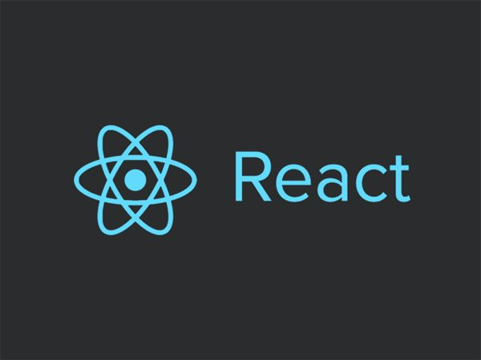

## 概述

React 起源于 Facebook 的内部项目，并于2013年5月开源。更多精彩见[React 官网](https://reactjs.org/ "React 官网")

<!-- more -->

### 声明式渲染
  

先来说明一下**命令式编程**和**声明式编程**：
**命令式编程关注怎么做**，通俗点说就是我们通过一行一行代码让机器照着一步一步的去做。例如我有一个数组，然后想通过它得到每个值都是它的值两倍的数组：

    const originArr = [1,2,3]; // 原始数组
    const resultArr = []; // 定义一个空数组
    for(let i = 0;i < originArr.length;i++){ // 遍历原始数组，然后将每个值乘于2之后添加到空数组中
        resultArr.push(originArr[i] * 2)
    }

**声明式编程关注做什么**，就是我们的目的。同样的例子适用声明式编程：

    const originArr = [1,2,3]; // 原始数组
    const resultArr = originArr.map(item => item * 2); // 遍历数组由map方法代为实现，而我们只需要关注我们要做什么：即把每个值乘于2

那么react的声明式渲染体现在什么地方呢？简单点说就是react独创的**JSX**语法，一种把html和js结合起来的成果，例如：

    const title = <h3>This is a title</h3> ; 

上述代码中`<h3>This is a title</h3>` 既非html也非字符串，我们可以叫它react element，实际上它在被react渲染成真实DOM之前只是一个普通的js对象，后面会有介绍。
React使用JSX语法让我们只需要是关注我们想要做什么，输入的state或者props，输出的UI界面，而不用分心关注于原生的DOM操作。

### 组件化

在React中一切皆组件，组件是React中最基本的单元结构。大到整个页面，小到一个按钮或者弹窗都可以成为一个组件。

### 可移植性强

React不仅可以在web端使用，它还可以借助nodejs在server端渲染，还可以借助 React Native 开发移动端应用。

## 使用React

React并不强制开发者在项目中完全使用或者完全不用，所以我们可是尝试性的在项目的某个部分使用React，也可以完整的使用React完成项目。

### 局部使用React

可以在html中通过script标签引入react框架的CDN链接：

    
    

这是React官方给出的CDN 链接，考虑到网络问题，我们可以自由选择其他的可靠资源，或者下载之后上传并使用自己的CDN服务。完整的Demo请参考 [局部使用React](https://gist.github.com/gaearon/6668a1f6986742109c00a581ce704605 "局部使用React")

**如果想使用JSX，需要额外引入，详情请见[引入JSX](http://reactjs.org/docs/add-react-to-a-website.html#add-jsx-to-a-project "引入JSX")**

### 完整使用React

基于React的框架也有不少，下面这几个是官方推荐使用的：
- 创建一个SPA，使用[Create React App](https://github.com/facebook/create-react-app#create-react-app- "Create React App")
- 如果想使用react+nodejs创建后端渲染（SSR）应用，可以使用[Next.js](https://nextjs.org/ "Next.js")
- 创建一个静态页面网站，可以使用[Gatsby](https://www.gatsbyjs.org/ "Gatsby")

    npx create-react-app my-app
    cd my-app
    npm start

可以通过上面的命令行完成使用creat react app来创建一个react 应用。

## JSX语法

    const el = (
        

            <button onClick={handleClick}>Click me</button>
        

    )

    const el = React.createElement(
        'div',
        {className: 'box',customizeProp:'test'},
        React.createElement(
            'button',
            {onClick:handleClick},
            'Click me'
        )
    );

点语法：

    const MyComponents = {
        DatePicker: function DatePicker(props) {
            return 
Imagine a {props.color} datepicker here.
;
        }
    }

    function BlueDatePicker() {
        return <MyComponents.DatePicker color="blue" />;
    }

展开符属性写法：

    function App2() {
    const props = {firstName: 'Ben', lastName: 'Hector'};
    return <Greeting {...props} />;
    }

## react lazy load

    const OtherComponent = React.lazy(() => import('./OtherComponent'));

    

      <Suspense fallback={
Loading...
}>  // 组件加载过程中出现，类似传统loading效果
        <section>
          <OtherComponent />
        </section>
      </Suspense>
    

## context

    定义：
    const MyContext = React.createContext(defaultValue);

    使用：
    父组件或者以上：
    <MyContext.Provider value={theme}>
        <ThemedButton changeTheme={this.toggleTheme} />
    </MyContext.Provider>
    子组件：
    class ThemedButton extends React.Component {
        static contextType = MyContext;  // 1 与3的点操作符方式二选一
        render() {
            let props = this.props;
            let theme = this.context;  // 2
            return (
            <button
                {...props}
                style={{backgroundColor: theme.background}}
            />
            );
            // 或者不使用1&2或3&2，使用Consumer，如果在一个组件里想使用多个context，只能使用Consumer+Provider，进行层层包裹
            <MyContext.Consumer>
            {(theme) => (
                <button
                    {...props}
                    style={{backgroundColor: theme.background}}
                />
            )}
            </MyContext.Consumer>
        }
    }
    ThemedButton.contextType = MyContext; // 3

    export default ThemedButton;

## error boundary

    class ErrorBoundary extends React.Component {
        constructor(props) {
            super(props);
            this.state = { hasError: false };
        }

        static getDerivedStateFromError(error) {    // 1
            // Update state so the next render will show the fallback UI.
            return { hasError: true };
        }

        componentDidCatch(error, info) {     // 2
            // You can also log the error to an error reporting service
            logErrorToMyService(error, info);
        }

        render() {
            if (this.state.hasError) {
            // You can render any custom fallback UI
            return <h1>Something went wrong.</h1>;
            }

            return this.props.children; 
        }
    }

如果有1或者2或者同时存在，则为error boundary组件，用法如下：

    <ErrorBoundary>
        <Children />
    </ErrorBoundary>

error boundary比较类似try{}catch(){}中catch代码块，另外需要注意的是**只有class组件可以成为error boundary，函数组件是不行的，这主要是因为函数组件是不支持组件自有的state特性的**。error boundary几乎可以捕捉到它的子组件任何地方和任何时候的错误，但下列情况的错误是捕捉不到的：

- 事件处理函数中错误（可以考虑使用try/catch进行错误捕捉）
- 异步代码中错误
- 后端渲染部分的错误
- 以及error boundary自身的报错

## ref的传递

创建一个组件FancyButton，如果我们想要通过ref访问他的自组件button，

    1. 通过createRef创建一个ref
    2. 将ref放入FancyButton的ref属性中
    3. FancyButton通过React.forwardRef将ref传递至button
    4. 此时当我们访问ref.current时将指向button
   
    const FancyButton = React.forwardRef((props, ref) => (   // 此处可使用function name(){}来代替匿名函数，以实现自定义函数名称
        <button ref={ref} className="FancyButton">
            {props.children}
        </button>
    ));
    You can now get a ref directly to the DOM button:
    const ref = React.createRef();
    <FancyButton ref={ref}>
        Click me!
    </FancyButton>;

在高阶组件中传递ref：

    function logProps(Component) {
        class LogProps extends React.Component {
            componentDidUpdate(prevProps) {
                console.log('old props:', prevProps);
                console.log('new props:', this.props);
            }

            render() {
                const {forwardedRef, ...rest} = this.props;

                // Assign the custom prop "forwardedRef" as a ref
                return <Component ref={forwardedRef} {...rest} />;
            }
        }

        // Note the second param "ref" provided by React.forwardRef.
        // We can pass it along to LogProps as a regular prop, e.g. "forwardedRef"
        // And it can then be attached to the Component.
        return React.forwardRef((props, ref) => {
            return <LogProps {...props} forwardedRef={ref} />;
        });
    }

## Fragments

- 可以单独从react中引用：import {Fragment} from 'react'
- 也可以不单独引用， `<React.Fragment><Children /></React.Fragment>`
- 还可以使用简写语法 `<><Children /></>`

渲染出的结果将会是单纯的`<Children />`,而不存在任何父元素

## HOC（高阶组件）

定义： 一个函数，接受一个react组件作为参数，并且返回一个react组件，这个函数就称为高阶组件，**高阶组件是一个纯函数，他不会改变作为参数的组件**

    function logProps(WrappedComponent) {
        return class extends React.Component {
            componentWillReceiveProps(nextProps) {
                console.log('Current props: ', this.props);
                console.log('Next props: ', nextProps);
            }
            render() {
                // Wraps the input component in a container, without mutating it. Good!
                return <WrappedComponent {...this.props} />;
            }
        }
    }

